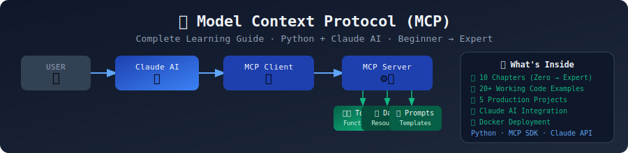

# 🤖 Complete MCP (Model Context Protocol) Learning Guide

> **From Zero to Expert** — A step-by-step guide for 15,000+ students learning to build real AI systems with Claude AI and MCP.



---

## 🎯 What You Will Learn

By the end of this guide, you will be able to:

- ✅ Understand what MCP is and why it exists
- ✅ Build MCP servers in Python from scratch
- ✅ Create real tools, resources, and prompts
- ✅ Connect your tools to Claude AI
- ✅ Build production-grade AI agents
- ✅ Design multi-server MCP architectures
- ✅ Deploy MCP systems to the cloud

---

## 📚 Who Is This For?

| Level | You Are... | This Guide Gives You |
|-------|-----------|----------------------|
| 🌱 Beginner | New to AI & MCP | Step-by-step foundation |
| 🔧 Intermediate | Know Python basics | Real tools + Claude integration |
| 🚀 Advanced | Building AI products | Production patterns + projects |

**No prior AI experience needed.** If you know basic Python, you can follow this guide.

---

## 🗂️ Guide Structure

```
mcp-complete-guide/
│
├── 📖 docs/                    ← Complete written guide (start here)
│   ├── 01_introduction.md
│   ├── 02_architecture.md
│   ├── 03_first_server.md
│   ├── 04_tools.md
│   ├── 05_resources.md
│   ├── 06_prompts.md
│   ├── 07_client_features.md
│   ├── 08_claude_integration.md
│   ├── 09_advanced_patterns.md
│   └── 10_production.md
│
├── 💻 examples/                ← Working code for every concept
│   ├── 01_basic/
│   ├── 02_tools/
│   ├── 03_resources/
│   ├── 04_prompts/
│   ├── 05_streaming/
│   ├── 06_multiserver/
│   ├── 07_claude_integration/
│   └── 08_advanced_agents/
│
├── 🏗️ projects/               ← 5 complete production projects
│   ├── weather_agent/
│   ├── github_agent/
│   ├── research_agent/
│   ├── coding_agent/
│   └── database_agent/
│
└── 🧪 tests/                  ← Test all your servers
```

---

## 🚀 Quick Start (5 Minutes)

### Step 1: Clone the repo
```bash
git clone https://github.com/yourname/mcp-complete-guide
cd mcp-complete-guide
```

### Step 2: Install dependencies
```bash
pip install -r requirements.txt
```

### Step 3: Run your first MCP server
```bash
python examples/01_basic/hello_server.py
```

### Step 4: Connect to Claude Desktop
See [docs/08_claude_integration.md](docs/08_claude_integration.md) for setup.

---

## 📖 Reading Order

Follow this order for the best learning experience:

1. [Introduction to MCP](docs/01_introduction.md) ← **Start Here**
2. [MCP Architecture](docs/02_architecture.md)
3. [Your First Server](docs/03_first_server.md)
4. [Building Tools](docs/04_tools.md)
5. [Resources & Data](docs/05_resources.md)
6. [Prompts & Templates](docs/06_prompts.md)
7. [Client Features](docs/07_client_features.md)
8. [Claude AI Integration](docs/08_claude_integration.md)
9. [Advanced Patterns](docs/09_advanced_patterns.md)
10. [Production Systems](docs/10_production.md)

---

## 🏆 Projects Included

| # | Project | Difficulty | What It Does |
|---|---------|-----------|--------------|
| 1 | [Weather Agent](projects/weather_agent/) | 🌱 Beginner | Real weather data + alerts |
| 2 | [GitHub Agent](projects/github_agent/) | 🔧 Intermediate | Read repos, create issues |
| 3 | [Research Agent](projects/research_agent/) | 🔧 Intermediate | Web search + summarize |
| 4 | [Coding Agent](projects/coding_agent/) | 🚀 Advanced | Read, write, run code |
| 5 | [Database Agent](projects/database_agent/) | 🚀 Advanced | SQL queries + analysis |

---

## ⚡ Technology Stack

- **Language:** Python 3.10+
- **MCP SDK:** `mcp` (official Anthropic SDK)
- **AI Model:** Claude AI (Anthropic)
- **Transport:** stdio (local) + HTTP (remote)

---

## 📦 Installation

```bash
pip install mcp httpx python-dotenv requests
```

Full requirements: [requirements.txt](requirements.txt)

---

## 🤝 Contributing

Found an error? Have a better example? PRs are welcome!

---

## 📄 License

MIT License — free to use for learning and projects.

---

## ⭐ Star This Repo

If this guide helped you, please give it a ⭐ — it helps 15,000+ other students find it!

---

*Built with ❤️ for students learning MCP and Claude AI* 

